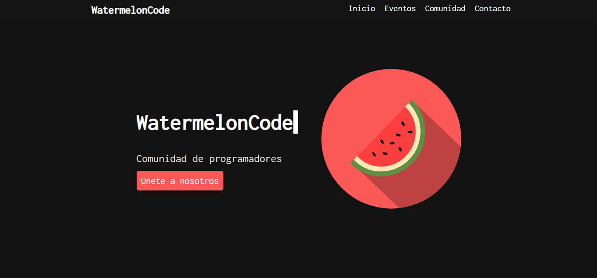

# Watermelon Code
la web oficial de <a href="https://watermeloncodecomunity.netlify.app/">watermeloncode</a> comunity 
<h2>¿Que es watermelon Code?</h2>

Comunidad de programadores destinada al ambito de la informática y la programación, en este grupo encontraras ayuda de gente experimentada, podrás aprender diariamente nuevas cosas, enfretarte a desafios, estar en talleres y participar de proyectos comunitarios.

Watermelon Code esta dispuesto a ayudar a todo tipo de desarrolladores, sin importar sus creencias o preferencias.

<h2>¿Que hacemos?</h2>
En nuestro servidor organizamos multitud de eventos cosas como talleres, competiciones, charlas o incluso torneos informales de programacion son frecuentes en el servidor
 

  <strong>Hecho por Jansel Roa &copy 2022 - 2023</string>

